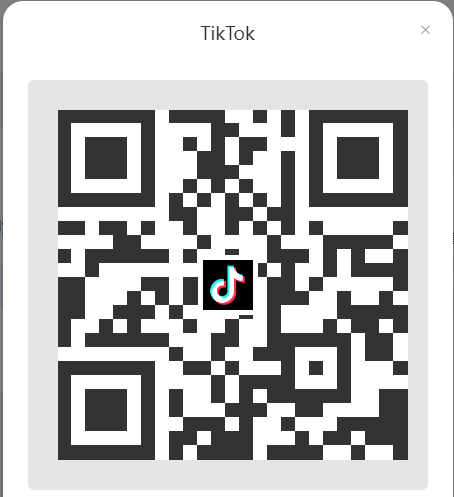

# tiktok-conf


## 特别说明：可全程手机端操作，无需PC端操作。


## 一、	准备：
1. 先卸载手机已安装的TikTok，避免触发限制；
2. TikTok 21.1.0.ipa：需使用美区appleID账号登录iTunes下载从 iTunes for Windows V 12.6.5.3抓包历史版本TikTok 21.1.0.ipa（已将TikTok 21.1.0.ipa发布在悟空在线内侧分发系统平台，可在后续详细描述中扫码获取）；
    ###### 链接：<https://pan.baidu.com/s/11h6SmuYSGl-P1oZISGJnIg>{:target="_blank"}
    ###### 提取码：og0w
4.	shadowrocket；
5.	代理节点。


## 二、	操作步骤：
### 1. 配置shadowrocket：
1) HTTPS解密、生成CA证书：打开shadowrocket【配置】->【本地文件（当前使用的配置，如：default.conf）】->【最右侧感叹号】->【HTTPS解密】->【开启HTTPS解密】->【证书】->【生成新的CA证书】->【生成新的CA证书】->【安装证书】->弹出确认框，此网站正尝试下载一个配置描述文件【允许】->已下载描述文件【关闭】->【右上角勾】->【右上角勾】；
2) 安装CA证书：打开手机【设置】->【通用】->【VPN与设备管理】->已下载的描述文件【Shadowrocket 2023********】->【安装】->【输入手机解锁密码】->【安装】->【安装】->【完成】；打开手机【设置】->【通用】->【关于手机】->【证书信任设置】->针对根证书启用完全信任【Shadowrocket 2023********】->【右侧开关键开启信任】->【继续】；
3) 添加模块：打开shadowrocket【配置】->【模块】->【右上角加号】->从给定的URL下载配置【复制粘贴下列各国模块的配置URL】->【下载】（因为是GitHub上存储的配置URL，所以需要开启代理才能访问GitHub）下载成功后自动切换配置：
   ###### 日本：
    ```
    https://raw.githubusercontent.com/bybgz/tiktok-conf/master/shadowrocket/tiktok-jp.conf
    ```
    ###### 韩国：
    ```
    https://raw.githubusercontent.com/bybgz/tiktok-conf/master/shadowrocket/tiktok-kr.conf
    ```
    ###### 台湾：
    ```
    https://raw.githubusercontent.com/bybgz/tiktok-conf/master/shadowrocket/tiktok-tw.conf
    ```
    ###### 英国：
    ```
    https://raw.githubusercontent.com/bybgz/tiktok-conf/master/shadowrocket/tiktok-uk.conf
    ```
    ###### 美国：
    ```
    https://raw.githubusercontent.com/bybgz/tiktok-conf/master/shadowrocket/tiktok-us.conf
    ```
8) 添加规则：打开shadowrocket【配置】->【本地文件（当前使用的配置，如：default.conf）】->【最右边感叹号】->【规则】->【右上角加号】->类型选择【RULE-SET】->策略选择【PROXY】->域名【复制粘贴下面的规则配置链接】->【保存】：
    ```
    https://raw.githubusercontent.com/bybgz/tiktok-conf/master/shadowrocket/tiktok.list
    ```


### 2.	懒人法安装TikTok 21.1.0.ipa：
1) PC端：手机连接PC通过爱思助手【我的助手】->【应用游戏】->【导入安装】，可直接导入安装，无需签名验证； 
2) 手机端：扫码访问悟空在线内侧分发系统平台，输入密码确认后进行下载安装，无需验证签名，或访问链接 <https://wkzx.wang/suyV>{:target="_blank"}




### 3.	shadowrocket开启代理即可使用TIKTOK。（此版本为v21.1.0，可登录美区appleID账号将TikTok更新至最新版本v31.9.0，已测可正常使用）。

